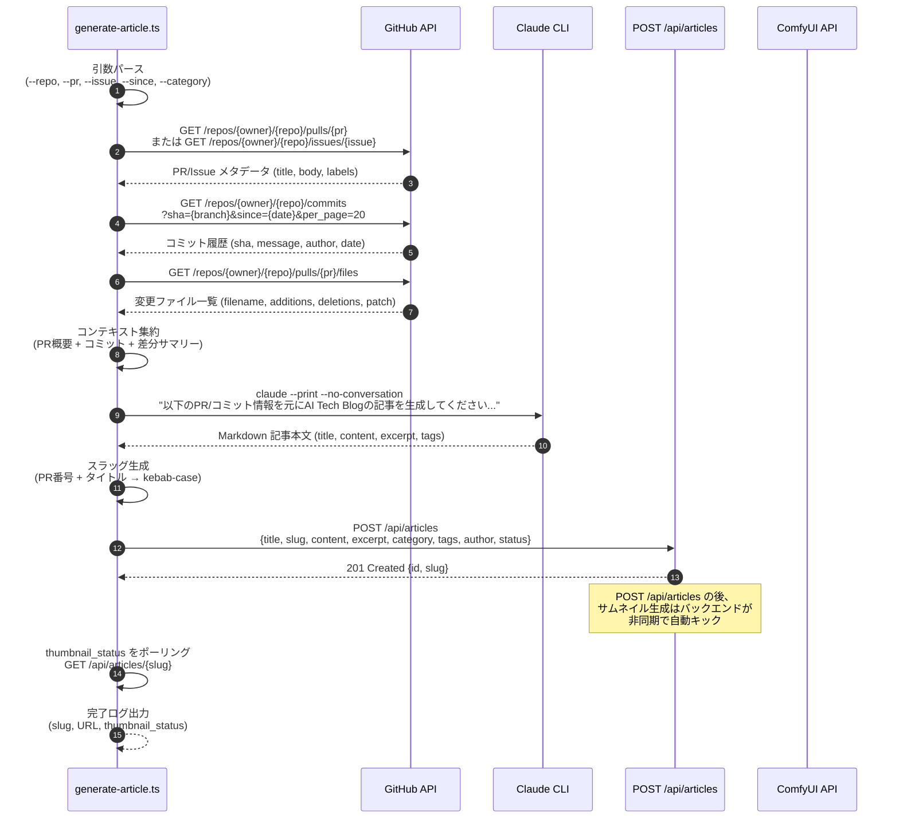

# 内部設計仕様書 — AI Tech Blog #27 ブログコンテンツ自動生成

**バージョン**: 1.0
**作成日**: 2026-03-27
**作成者**: System Engineer
**対象**: SDD #27 — ブログコンテンツ自動生成パイプライン + 関連記事API

---

## 1. 既存アーキテクチャ概要

### スタック
- **フロントエンド**: Astro 6（SSR/SSG）
- **バックエンド**: Fastify 5 + postgres.js
- **DB**: PostgreSQL（UUID primary key、マイグレーション管理済み）
- **画像生成**: ComfyUI（Flux.1-schnell GGUF）
- **リバースプロキシ**: Caddy

### 既存 articles テーブル（Migration v2〜v5）

```sql
CREATE TABLE articles (
  id                    UUID PRIMARY KEY DEFAULT gen_random_uuid(),
  title                 VARCHAR(500) NOT NULL,
  slug                  VARCHAR(500) NOT NULL UNIQUE,
  content               TEXT NOT NULL,
  excerpt               VARCHAR(1000) NOT NULL,
  category              VARCHAR(100) NOT NULL,  -- 'claude-code' | 'ai-hacks' | 'ai-news' | 'tech'
  tags                  TEXT[] DEFAULT '{}',
  author                VARCHAR(200) NOT NULL DEFAULT 'anonymous',
  status                VARCHAR(20) NOT NULL DEFAULT 'draft',  -- 'draft' | 'published' | 'archived'
  published_at          TIMESTAMPTZ,
  created_at            TIMESTAMPTZ NOT NULL DEFAULT NOW(),
  updated_at            TIMESTAMPTZ NOT NULL DEFAULT NOW(),
  thumbnail_url         VARCHAR(500),
  thumbnail_prompt      TEXT,
  thumbnail_status      VARCHAR(20) NOT NULL DEFAULT 'none',  -- 'none' | 'generating' | 'completed' | 'failed'
  thumbnail_error       TEXT,
  thumbnail_generated_at TIMESTAMPTZ
);
```

### 既存インデックス
- `idx_articles_slug` — slug 検索
- `idx_articles_status` — status フィルタ
- `idx_articles_published` — published_at DESC WHERE status = 'published'
- `idx_articles_category` — カテゴリフィルタ
- `idx_articles_thumbnail_status` — サムネイルステータス監視

---

## 2. 自動記事生成パイプライン

### 2.1 概要

`scripts/generate-article.ts` は単一の CLI スクリプトとして実装する。
引数で対象リポジトリ・PR番号（またはモード）を指定し、以下の4フェーズを順次実行する。

### 2.2 実行フロー



### 2.3 CLIインターフェース

```
Usage:
  npx ts-node scripts/generate-article.ts [options]

Options:
  --repo <owner/repo>     対象リポジトリ (必須)
  --pr <number>           PR番号 (--issue と排他)
  --issue <number>        Issue番号 (--pr と排他)
  --since <ISO date>      このタイムスタンプ以降のコミットを取得 (--pr 省略時に使用)
  --category <name>       カテゴリ (claude-code | ai-hacks | ai-news | tech, デフォルト: tech)
  --author <name>         著者名 (デフォルト: ttoClaw)
  --status <draft|published>  投稿ステータス (デフォルト: draft)
  --dry-run               API投稿せずに生成記事を stdout に出力
```

### 2.4 GitHub API 取得戦略

| フェーズ | エンドポイント | 取得データ |
|---------|--------------|-----------|
| PR情報 | `GET /repos/{owner}/{repo}/pulls/{pr}` | title, body, labels, merged_at, base/head sha |
| Issue情報 | `GET /repos/{owner}/{repo}/issues/{issue}` | title, body, labels, comments |
| コミット履歴 | `GET /repos/{owner}/{repo}/commits?sha={head}&per_page=20` | sha, commit.message, author |
| 変更ファイル | `GET /repos/{owner}/{repo}/pulls/{pr}/files` | filename, status, additions, deletions, patch (先頭200行) |

**認証**: `GITHUB_TOKEN` 環境変数（Bearer認証）
**レート制限対策**: 認証済みで5000req/h。各リクエストに `X-RateLimit-Remaining` をチェックし、100未満なら60秒待機。

### 2.5 Claude CLI プロンプト設計

```
システムプロンプト:
あなたは AI Tech Blog のテクニカルライターです。
エンジニア向けのわかりやすく実践的な記事を日本語で書いてください。

ユーザープロンプト:
以下の GitHub {PR/Issue} 情報を元に、AI Tech Blog の記事を生成してください。

## PR/Issue 情報
タイトル: {title}
説明: {body}
ラベル: {labels}

## コミット履歴
{commits: sha: message の箇条書き}

## 主な変更ファイル
{files: 上位10ファイルのパスと変更行数}

## 出力形式 (JSON)
{
  "title": "記事タイトル（50文字以内）",
  "excerpt": "記事の概要（100〜200文字）",
  "tags": ["タグ1", "タグ2", ...],  // 3〜5個
  "content": "Markdown形式の記事本文（見出し・コードブロック使用、1000〜3000文字）"
}
```

**実行コマンド**:
```bash
claude --print --no-conversation --model claude-sonnet-4-6 \
  "$(cat /tmp/prompt.txt)"
```

### 2.6 入力値バリデーション・サニタイズ方針

| 項目 | 処理 |
|------|------|
| `--repo` | `/^[a-zA-Z0-9_.-]+\/[a-zA-Z0-9_.-]+$/` にマッチしない場合は即終了 |
| `--pr` / `--issue` | 正の整数のみ許可。`parseInt` 後 `isNaN` チェック |
| Claude 出力 | `JSON.parse` で必ず構造化パース。パース失敗時はリトライ（最大3回） |
| `title` | 500文字に切り詰め。HTML タグ除去（`/<[^>]*>/g` で strip）|
| `content` | HTML タグ除去。Markdown のみ許可。10,000文字上限でカット |
| `excerpt` | 1000文字に切り詰め |
| `tags` | 配列の各要素を `trim()` し、空文字・重複を除去。最大10件 |
| `slug` | `[a-z0-9-]` 以外は除去 → 先頭末尾の `-` を除去 → 最大100文字 |

---

## 3. 関連記事API

### 3.1 エンドポイント設計

新規エンドポイントとして追加（既存の `GET /api/articles` を汚染しない）。

```
GET /api/articles/:slug/related
```

**パスパラメータ**:
- `slug` — 起点となる記事のスラッグ

**レスポンス**:

```typescript
// 200 OK
{
  data: ArticleSummary[]  // 最大3件
}

// 404 Not Found
{
  error: { code: "NOT_FOUND", message: "Article not found" }
}
```

`ArticleSummary` は `Article` から `content` を除いたもの（一覧と同じフィールド）。

### 3.2 関連度スコアリングアルゴリズム

```sql
-- 対象記事の category と tags を取得
SELECT category, tags FROM articles WHERE slug = :slug;

-- 関連スコアを計算して上位3件を返す
SELECT
  id, title, slug, excerpt, category, tags, author,
  status, published_at, created_at,
  thumbnail_url, thumbnail_status,
  -- スコア計算
  (
    CASE WHEN category = :category THEN 1.0 ELSE 0.0 END
    + (
      SELECT COUNT(*)::float * 0.5
      FROM unnest(tags) t
      WHERE t = ANY(:tags)
    )
  ) AS relevance_score
FROM articles
WHERE
  slug != :slug
  AND status = 'published'
ORDER BY
  relevance_score DESC,
  published_at DESC NULLS LAST
LIMIT 3;
```

**スコアリング詳細**:

| 条件 | スコア加算 |
|------|-----------|
| 同カテゴリ | +1.0 |
| 共通タグ1件につき | +0.5 |
| タイブレイク | published_at 降順（新しい記事優先）|

**例**:
- 起点記事: category=`claude-code`, tags=`["claude", "CI", "PR"]`
- 候補A: category=`claude-code`, tags=`["claude", "API"]` → 1.0 + 0.5 = **1.5**
- 候補B: category=`ai-hacks`, tags=`["claude", "CI", "LLM"]` → 0.0 + 1.0 = **1.0**
- 候補C: category=`tech`, tags=`["Docker"]` → 0.0 + 0.0 = **0.0**（published_at でソート）

### 3.3 DBクエリ最適化

新規インデックス（Migration v6 として追加）:

```sql
-- Migration v6: 関連記事クエリ最適化
ALTER TABLE articles ADD COLUMN IF NOT EXISTS tags_tsvector TSVECTOR
  GENERATED ALWAYS AS (array_to_tsvector(tags)) STORED;

CREATE INDEX IF NOT EXISTS idx_articles_tags_gin ON articles USING GIN (tags);
CREATE INDEX IF NOT EXISTS idx_articles_category_status ON articles (category, status);
```

`tags @> ARRAY[...]` の GIN インデックスにより、大量記事でも高速に共通タグを検索できる。

### 3.4 キャッシュ戦略

- 関連記事は記事更新・新規投稿時に変わり得るため **キャッシュなし**（まず実装シンプル優先）
- 記事数が1000件を超えた場合は Redis キャッシュ（TTL: 1時間）を検討

---

## 4. DBマイグレーション計画

### Migration v6（関連記事API向け）

```typescript
{
  version: 6,
  name: 'add_tags_gin_index_for_related',
  up: `
    CREATE INDEX IF NOT EXISTS idx_articles_tags_gin
      ON articles USING GIN (tags);
    CREATE INDEX IF NOT EXISTS idx_articles_category_status
      ON articles (category, status);
  `,
}
```

**既存データへの影響**: インデックス追加のみ。データ変更なし。ダウンタイムなしで実行可能。

---

## 5. 記事5本のメタデータ設計

AI Company OS の直近リリース（PR #798〜#809）を題材とする。

### 記事一覧

| # | slug | title | category | tags | excerpt |
|---|------|-------|----------|------|---------|
| 1 | `ai-company-os-orchestrator-architecture` | AI Company OS のオーケストレーターアーキテクチャ完全解説 | `claude-code` | `["AI Company OS", "アーキテクチャ", "orchestrator", "launchd", "MCP"]` | AI Company OS の中核を担う orchestrator の設計思想と、launchd 連携・MCP ツール・エージェント管理の全体像を詳説します。 |
| 2 | `qmo-fullcycle-scoring-practice` | QMOフルサイクル品質管理 — 実践スコアリングガイド | `claude-code` | `["QMO", "品質管理", "スコアリング", "Gate", "エージェント"]` | 10ロール×6ゲートの QMO フルサイクルを実際のスコアリング記録で解説。PASS/CONDITIONAL/FAIL の判断基準と改善フローを紹介します。 |
| 3 | `remotion-market-analysis-video` | Remotion で作る自動市場分析動画パイプライン | `tech` | `["Remotion", "動画生成", "市場分析", "React", "自動化"]` | React ベースの動画生成フレームワーク Remotion を使い、市場データを自動的にアニメーション付き分析動画に変換するパイプラインの構築方法を解説します。 |
| 4 | `comfyui-flux-ai-novel-illustration` | ComfyUI + Flux.1 で AI小説イラストを自動生成する | `ai-hacks` | `["ComfyUI", "Flux.1", "イラスト生成", "AI Novels", "自動化"]` | AI Novels プラットフォームで実践している ComfyUI + Flux.1-schnell によるイラスト自動生成パイプラインの技術詳細と設定ノウハウを共有します。 |
| 5 | `claude-code-multi-agent-team-operation` | Claude Code マルチエージェントチーム運用の実践知見 | `claude-code` | `["Claude Code", "マルチエージェント", "TeamCreate", "SendMessage", "運用"]` | Claude Code の TeamCreate/SendMessage/TaskCreate を活用したマルチエージェントチーム運用の実践パターンと、QMO フルサイクルでの並列開発ノウハウを解説します。 |

### 各記事の詳細メタデータ

#### 記事1: AI Company OS のオーケストレーターアーキテクチャ完全解説

```json
{
  "slug": "ai-company-os-orchestrator-architecture",
  "title": "AI Company OS のオーケストレーターアーキテクチャ完全解説",
  "category": "claude-code",
  "tags": ["AI Company OS", "アーキテクチャ", "orchestrator", "launchd", "MCP"],
  "author": "ttoClaw",
  "status": "published",
  "excerpt": "AI Company OS の中核を担う orchestrator の設計思想と、launchd 連携・MCP ツール・エージェント管理の全体像を詳説します。"
}
```

#### 記事2: QMOフルサイクル品質管理 — 実践スコアリングガイド

```json
{
  "slug": "qmo-fullcycle-scoring-practice",
  "title": "QMOフルサイクル品質管理 — 実践スコアリングガイド",
  "category": "claude-code",
  "tags": ["QMO", "品質管理", "スコアリング", "Gate", "エージェント"],
  "author": "ttoClaw",
  "status": "published",
  "excerpt": "10ロール×6ゲートの QMO フルサイクルを実際のスコアリング記録で解説。PASS/CONDITIONAL/FAIL の判断基準と改善フローを紹介します。"
}
```

#### 記事3: Remotion で作る自動市場分析動画パイプライン

```json
{
  "slug": "remotion-market-analysis-video",
  "title": "Remotion で作る自動市場分析動画パイプライン",
  "category": "tech",
  "tags": ["Remotion", "動画生成", "市場分析", "React", "自動化"],
  "author": "ttoClaw",
  "status": "published",
  "excerpt": "React ベースの動画生成フレームワーク Remotion を使い、市場データを自動的にアニメーション付き分析動画に変換するパイプラインの構築方法を解説します。"
}
```

#### 記事4: ComfyUI + Flux.1 で AI小説イラストを自動生成する

```json
{
  "slug": "comfyui-flux-ai-novel-illustration",
  "title": "ComfyUI + Flux.1 で AI小説イラストを自動生成する",
  "category": "ai-hacks",
  "tags": ["ComfyUI", "Flux.1", "イラスト生成", "AI Novels", "自動化"],
  "author": "ttoClaw",
  "status": "published",
  "excerpt": "AI Novels プラットフォームで実践している ComfyUI + Flux.1-schnell によるイラスト自動生成パイプラインの技術詳細と設定ノウハウを共有します。"
}
```

#### 記事5: Claude Code マルチエージェントチーム運用の実践知見

```json
{
  "slug": "claude-code-multi-agent-team-operation",
  "title": "Claude Code マルチエージェントチーム運用の実践知見",
  "category": "claude-code",
  "tags": ["Claude Code", "マルチエージェント", "TeamCreate", "SendMessage", "運用"],
  "author": "ttoClaw",
  "status": "published",
  "excerpt": "Claude Code の TeamCreate/SendMessage/TaskCreate を活用したマルチエージェントチーム運用の実践パターンと、QMO フルサイクルでの並列開発ノウハウを解説します。"
}
```

---

## 6. セキュリティ設計

### 6.1 入力値サニタイズ方針（DR-G2-03 準拠）

| 入力元 | サニタイズ内容 |
|--------|--------------|
| CLI 引数 (`--repo` 等) | 正規表現バリデーション。許可パターン以外は即 process.exit(1) |
| GitHub API レスポンス | JSON.parse による構造化。`title` / `body` のHTMLタグ除去（`/<[^>]*>/g`） |
| Claude CLI 出力 | JSON.parse + スキーマバリデーション（zod または手動チェック）。パース失敗でリトライ上限3回 |
| POST /api/articles body | 既存バリデーション（`requireAuth` + フィールドチェック）をそのまま活用 |
| GET /api/articles/:slug/related の slug | `^[a-z0-9][a-z0-9-]*[a-z0-9]$` チェック。不一致は 400 を返す |

### 6.2 認証方針

- `POST /api/articles` は既存の `requireAuth` ミドルウェアを使用（変更なし）
- `GET /api/articles/:slug/related` は認証不要（公開API）
- `generate-article.ts` スクリプトは `API_SECRET_KEY` 環境変数を Authorization ヘッダーに設定

### 6.3 コマンドインジェクション対策

- `claude` CLI の呼び出しには `child_process.execFile` を使用（`exec` は使わない）
- プロンプト文字列はファイル経由で渡す（`/tmp/prompt-{uuid}.txt`）
- 処理後に一時ファイルを削除（`finally` ブロック内）

---

## 7. 非機能要件

| 項目 | 要件 |
|------|------|
| 関連記事API レスポンス時間 | p99 < 100ms（インデックス活用で達成） |
| 自動記事生成スクリプト実行時間 | 全体 < 5分（GitHub API 3リクエスト + Claude生成 + サムネイル待機除く） |
| 関連記事 API 同時実行 | Fastify のデフォルト並行数で対応（チューニング不要） |
| DB マイグレーション | ダウンタイムなしで適用可能（インデックス追加のみ） |

---

## 8. テスタビリティ考慮事項（DR-G2-04 準拠）

### 8.1 自動記事生成パイプライン

| テスト観点 | テスト方法 |
|-----------|-----------|
| GitHub API 取得 | `GITHUB_TOKEN` 環境変数なしで実行 → エラーメッセージを検証 |
| Claude CLI 出力パース | stdout フィクスチャを使ったユニットテスト |
| `--dry-run` モード | stdout に JSON が出力され、POST /api/articles が呼ばれないことを確認 |
| スラッグ重複時 | 409 レスポンスを受け取った場合のリトライロジック（スラッグにサフィックス追加） |

### 8.2 関連記事API

| テスト観点 | テスト方法 |
|-----------|-----------|
| 存在しない slug | 404 レスポンスを返すことを確認 |
| 関連記事0件 | 空配列 `[]` を返すことを確認 |
| スコアリング正確性 | テスト記事を DB に挿入し、スコア順が期待通りであることを確認 |
| タイブレイク（published_at） | 同スコアの記事が published_at 降順で返ることを確認 |
| slug インジェクション | `'; DROP TABLE articles; --` を渡して 400 を返すことを確認 |

### 8.3 並行性テスト考慮（DR-G1-04 準拠）

- 関連記事 API への同一 slug への並行リクエスト（10同時）でデータ不整合が起きないことを確認
- `generate-article.ts` の複数プロセス同時実行で slug 重複衝突（409）が正しく処理されることを確認

---

*以上*
